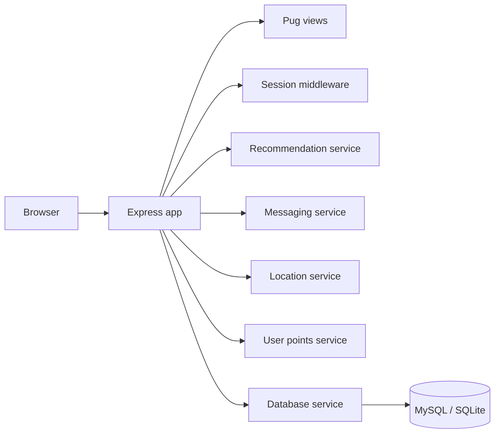

# Minimise Food Waste


A full-stack university software-engineering project for a community food-sharing platform. The application is designed to help users reduce food waste by listing surplus food, discovering nearby items, receiving recommendations and communicating with other users.

This repository demonstrates **Node.js/Express development, server-rendered UI, service-layer organisation, sessions, database integration scaffolding, Docker and collaborative software engineering**.

## Portfolio highlights

- Built an **Express.js** web application with multiple user-facing routes and workflows.
- Used **Pug** templates and Bootstrap-based styling for server-rendered pages.
- Implemented food listings with category, quantity, expiry, location, dietary and pickup information.
- Added application services for **recommendations, messaging, location logic and user points**.
- Added login/session behaviour and user-facing account flows.
- Included Docker-based development infrastructure for Node.js, MySQL and phpMyAdmin.
- Added database service code and MySQL/SQLite dependencies for persistence-oriented development.
- Included Nightwatch-based browser-test configuration in the project tooling.
- Added automated CI checks for dependency installation and JavaScript syntax validation.

## Final application walkthrough

The Sprint 4 documentation captures the final user-facing version of the food-sharing platform. The interface uses a consistent green visual theme and supports the core journey from account access through food discovery and personalised recommendations.

> The screenshots below are extracted from the project's Sprint 4 documentation and included here to show what the finished application looked like.

### Home page


The landing page introduces the food-waste reduction concept and gives users direct entry points into the platform's main workflows. The Sprint 4 documentation describes the home experience as providing routes to **share food** and access **recommendations**, with location-aware matching intended to connect food donors and recipients.

### Login and account access


The login page provides email and password fields as the main authenticated entry point to the application. The documented interface also includes a **remember me** option to reduce repeated sign-in steps for returning users.

### Browse available food


The browse page presents available food listings in a card-based layout. Listings expose practical information such as the food item, category, quantity and dietary suitability, helping users identify relevant items and avoid unsuitable food.

### Personalised recommendations


The recommendations screen presents personalised food matches and filtering controls. In the Sprint 4 design, the recommendation concept is described as using preference analysis and collaborative filtering based on user behaviour/history to surface more relevant listings.

### Wider final-app experience

The Sprint 4 project documentation also shows the completed design for:

- **Smart matchmaking** — a recommendation-oriented workflow explaining preference analysis and collaborative filtering.
- **Tag food / create listing** — lets donors enter a food name, category and sub-category, quality, photo and location.
- **User profile** — displays user details, items shared and received, ratings and food-sharing impact.
- **Messaging** — provides user conversations together with messaging activity information.
- **About page** — explains the food-waste problem and directs users towards browsing or sharing available food.

Together, these screens show the intended end-to-end product: users can sign in, discover surplus food, receive relevant recommendations, contribute their own food listings and interact with the wider sharing community.

## Skills demonstrated

| Area | Evidence in the repository |
| --- | --- |
| JavaScript / Node.js | Express application logic, routes and service modules |
| Backend development | Sessions, request handling, service separation and server-side rendering |
| Express.js | Route handling, middleware and static-content configuration |
| Frontend | Pug templates, Bootstrap, CSS and responsive page structure |
| Application design | Separate recommendation, messaging, location and points services |
| Data | MySQL/SQLite dependencies and database service layer |
| DevOps | Docker, Docker Compose and environment-based configuration scaffolding |
| Testing | Nightwatch configuration plus CI syntax/build checks |
| Collaboration | Multi-contributor repository and Git-based project workflow |

## Core product features

### Food listings
The application contains structured food-listing data with information such as:

- title and category
- quantity and unit
- expiry date
- pickup location/distance
- dietary and allergen information
- pickup times and contact method
- listing verification/condition information

### Recommendations
`recommendationService.js` separates recommendation-oriented logic from the main Express application.

### Messaging
`messagingService.js` provides a dedicated service for user-to-user communication behaviour used by message and conversation views.

### Location-aware behaviour
`locationService.js` contains location-related application logic for the food-sharing workflow.

### User points
`userPointsService.js` provides points/reward-oriented behaviour to support user engagement.

## Architecture



The main application is in `app/app.js`, while domain-specific behaviour is split into services under `app/services/`. This makes the repository easier to navigate than placing all business behaviour in route handlers.

See [`docs/ARCHITECTURE.md`](docs/ARCHITECTURE.md) for a concise repository map.

## Main views

The repository includes Pug views for workflows such as:

- home/landing pages
- login and sign-up
- food listings and detailed listing views
- recommendations
- messages and conversations
- user/profile-related pages
- about and error pages

## Project structure

```text
.
├── app/
│   ├── app.js
│   ├── public/
│   ├── services/
│   │   ├── db.js
│   │   ├── locationService.js
│   │   ├── messagingService.js
│   │   ├── recommendationService.js
│   │   └── userPointsService.js
│   └── views/
├── custom-tests/
├── database-file/
├── docs/
│   ├── ARCHITECTURE.md
│   └── screenshots/
│       └── final-app/
│           ├── home.jpg
│           ├── login.jpg
│           ├── browse-food.jpg
│           └── recommendations.jpg
├── Dockerfile
├── docker-compose.yml
├── docker-compose-deploy.yml
├── env-sample
├── package.json
├── package-lock.json
├── README.md
└── .github/workflows/node-ci.yml
```

## Quick start with Docker

### Requirements

- Docker Desktop
- Docker Compose

Create the local environment file from the sample:

```bash
cp env-sample .env
```

On Windows Command Prompt:

```cmd
copy env-sample .env
```

Then start the development stack:

```bash
docker compose up --build
```

The supplied Compose setup provides the Node.js application plus the database/development services configured by the coursework scaffold.

## Run with Node.js

If running outside Docker:

```bash
npm ci
npm start
```

The project uses `supervisor` in the development start script so relevant file changes can restart the app automatically.

## Testing and CI

The repository includes Nightwatch in `devDependencies` and browser-test files under `custom-tests/`.

The portfolio CI workflow performs a reliable baseline check on GitHub by:

1. installing dependencies with `npm ci`
2. checking the main Express application for JavaScript syntax errors
3. checking each service module for JavaScript syntax errors

This keeps the public repository continuously verifiable without depending on an interactive browser or external database service for the baseline CI job.

## Security and deployment scope

> [!IMPORTANT]
> This is an academic/demo application, not a production food-sharing platform.

The repository contains sample users and development-oriented session/data behaviour for coursework demonstration. Production deployment would require additional work such as secure credential storage, password hashing, CSRF protection, hardened session configuration, production database migrations, validation review and infrastructure/security testing.

## Academic context

This repository comes from university software-engineering work and demonstrates the process of building a larger web application around multiple features and contributors. The README has been reorganised for portfolio review so employers can quickly identify the implemented technologies, architecture and engineering skills.

## Author / repository owner

**Mohamed Ibrahim**  
BEng Software Engineering, University of Roehampton
