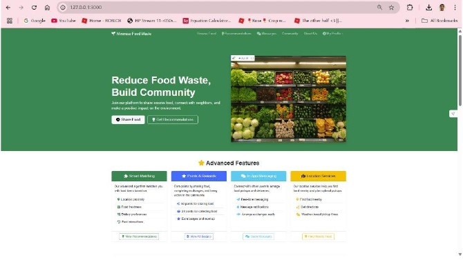
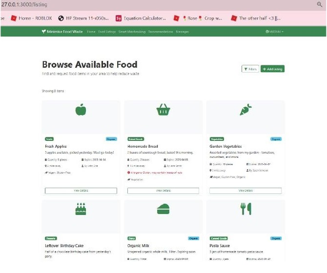
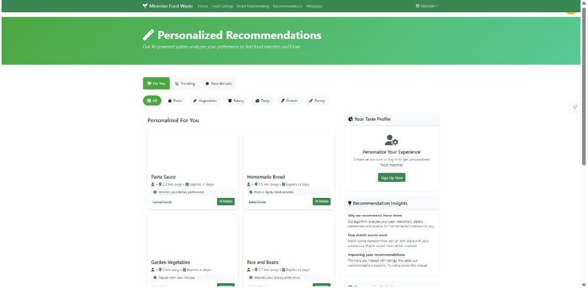
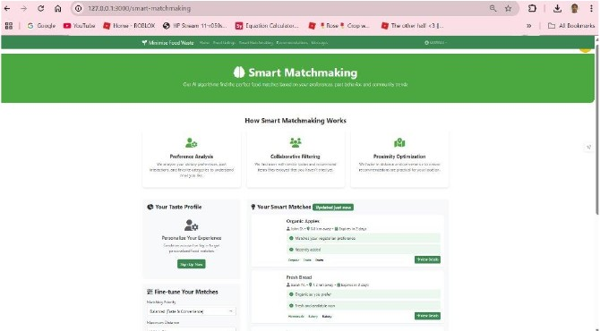
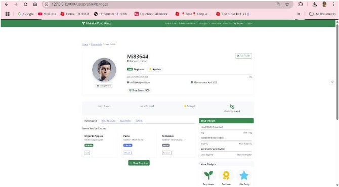
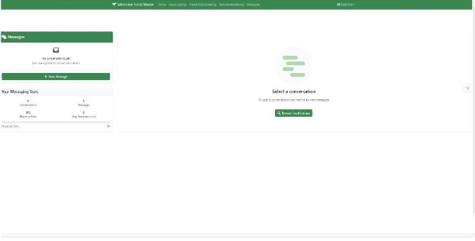
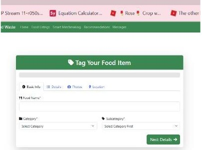
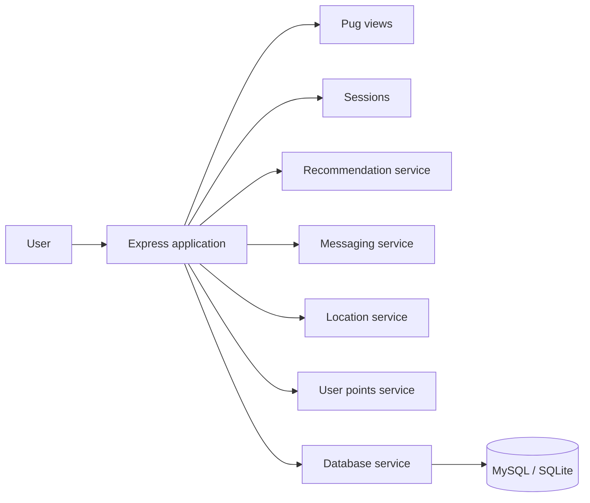

<div align="center">

# Minimise Food Waste

### Community food-sharing platform built with Node.js and Express

A full-stack university software engineering project designed to help people **share surplus food, discover available items, receive personalised recommendations and coordinate collection**.


</div>

---

## Overview

**Minimise Food Waste** is a community-focused web application built as a University of Roehampton software engineering team project. The application connects people who have surplus food with people who can use it, while supporting discovery, recommendations, messaging and user activity tracking.

### Core user journey

**Sign in → browse food → receive recommendations → share food → message users → track activity**

### Key features

- **Food sharing** — create structured surplus-food listings.
- **Browse available food** — view items with useful listing and dietary information.
- **Personalised recommendations** — surface food that is more relevant to the user.
- **Smart matchmaking** — support better donor/recipient matching through preference-oriented logic.
- **Messaging** — coordinate collection directly with other users.
- **Profiles and rewards** — track sharing activity, impact and points.
- **Location-aware behaviour** — support food discovery and collection workflows.

---

## Final application

The screenshots below are clean crops taken from the project's final Sprint 4 documentation. Click any image to open the full-size version.

| Home | Browse available food |
| --- | --- |
| [](docs/screenshots/final-app/home.jpg) | [](docs/screenshots/final-app/browse-available-food.jpg) |
| Main landing page with routes into sharing and recommendation features. | Card-based food discovery with item and dietary information. |

| Personalised recommendations | Smart matchmaking |
| --- | --- |
| [](docs/screenshots/final-app/recommendations.jpg) | [](docs/screenshots/final-app/smart-matchmaking.jpg) |
| Suggested food matches and filtering options. | Preference-oriented matching intended to surface more relevant items. |

| User profile | Messaging |
| --- | --- |
| [](docs/screenshots/final-app/user-profile.jpg) | [](docs/screenshots/final-app/messaging.jpg) |
| Account details, sharing activity, impact and rewards. | Conversation area for coordinating food collection. |

| Login | Tag food |
| --- | --- |
| [](docs/screenshots/final-app/login.jpg) | [](docs/screenshots/final-app/tag-food.jpg) |
| Email/password access with a remember-me option. | Structured workflow for creating a new food listing. |

For a screen-by-screen explanation, see **[Final Application Walkthrough](docs/FINAL_APP.md)**.

---

## Technology stack

| Area | Technology |
| --- | --- |
| **Frontend** | Pug templates, Bootstrap, CSS |
| **Backend** | JavaScript, Node.js, Express.js |
| **Data** | MySQL / SQLite |
| **Application structure** | Express routes, sessions and service modules |
| **Infrastructure** | Docker, Docker Compose |
| **Testing** | Nightwatch and custom tests |
| **CI** | GitHub Actions |
| **Collaboration** | Git and GitHub |

---

## Architecture



The main Express application is located in `app/app.js`. Feature-specific behaviour is separated into modules under `app/services/`.

### Main service modules

| Service | Responsibility |
| --- | --- |
| `recommendationService.js` | Recommendation-oriented application logic |
| `messagingService.js` | User-to-user messaging behaviour |
| `locationService.js` | Location-aware food-sharing logic |
| `userPointsService.js` | Points and reward-related behaviour |
| `db.js` | Database service layer |

More detail is available in **[Architecture Notes](docs/ARCHITECTURE.md)**.

---

## Repository structure

```text
.
├── app/
│   ├── app.js
│   ├── public/
│   ├── services/
│   └── views/
├── custom-tests/
├── database-file/
├── docs/
│   ├── ARCHITECTURE.md
│   ├── FINAL_APP.md
│   └── screenshots/
│       └── final-app/
├── .github/
│   └── workflows/
├── Dockerfile
├── docker-compose.yml
├── docker-compose-deploy.yml
├── env-sample
├── package.json
└── README.md
```

---

## Run locally

### Docker

**Requirements:** Docker Desktop and Docker Compose.

Create a local environment file:

```bash
cp env-sample .env
```

Windows Command Prompt:

```cmd
copy env-sample .env
```

Start the application:

```bash
docker compose up --build
```

### Node.js

```bash
npm ci
npm start
```

The development start script uses `supervisor` so relevant source changes can restart the application automatically.

---

## Testing and CI

The repository includes Nightwatch configuration, custom test files and GitHub Actions automation. The portfolio CI workflow provides a simple baseline by:

1. installing dependencies with `npm ci`;
2. validating the main Express application for JavaScript syntax errors;
3. validating the service modules for JavaScript syntax errors.

This keeps the public repository easy to verify without requiring an interactive browser or external database for the baseline CI job.

---

## Academic context

This repository is based on a **University of Roehampton software engineering team project**. It is presented here as a portfolio project so the final application, architecture, technologies and engineering work are easy to review.

> [!NOTE]
> This is an academic/demo application rather than a production food-sharing service. A production release would require additional security hardening, validation, database migration work and deployment testing.

## Repository owner

**Mohamed Ibrahim**  
BEng Software Engineering, University of Roehampton
