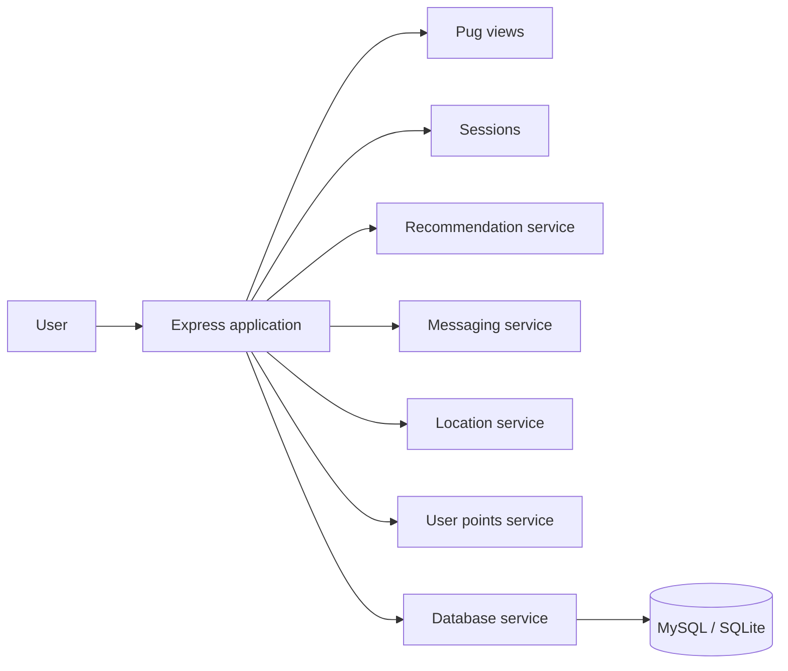

<div align="center">

# Minimise Food Waste

### A community food-sharing web application built with Node.js and Express

Reduce food waste by helping people **share surplus food, discover nearby listings, receive personalised recommendations and message other users**.


</div>

---

## Project at a glance

| | |
| --- | --- |
| **Project type** | Full-stack university software engineering team project |
| **Main goal** | Make it easier for communities to share surplus food instead of wasting it |
| **Core journey** | Sign in → browse food → get recommendations → share food → message users |
| **Frontend** | Pug templates, Bootstrap and CSS |
| **Backend** | Node.js, Express.js, sessions and service modules |
| **Data** | MySQL / SQLite |
| **DevOps & testing** | Docker, Docker Compose, Nightwatch and GitHub Actions |
| **Status** | Completed academic project, presented here as a portfolio showcase |

## Key features

- **Share surplus food** — create structured listings with food, quantity, expiry, location and dietary information.
- **Browse available food** — discover items through a simple card-based interface.
- **Personalised recommendations** — surface relevant listings using recommendation-oriented application logic.
- **Smart matchmaking** — help connect donors and recipients around suitable food items.
- **Messaging** — allow users to communicate and coordinate collection.
- **Profiles and rewards** — track account activity, sharing impact and points.

---

## Application preview

### Home page

<p align="center">
  <a href="docs/screenshots/final-app/home.jpg">
    
  </a>
</p>

The home page introduces the purpose of the platform and gives users quick access to the main food-sharing workflows.

### Login

<p align="center">
  <a href="docs/screenshots/final-app/login.jpg">
    
  </a>
</p>

The account flow includes email and password entry together with a **remember me** option for returning users.

> Click either screenshot to open the original image.

For the wider product journey, see **[Final Application Walkthrough](docs/FINAL_APP.md)**.

---

## How the application is organised



The main Express application lives in `app/app.js`. Feature-specific behaviour is separated into services under `app/services/`, making the project easier to navigate and maintain.

### Main service modules

| Service | Purpose |
| --- | --- |
| `recommendationService.js` | Recommendation-oriented application logic |
| `messagingService.js` | User-to-user messaging behaviour |
| `locationService.js` | Location-aware food-sharing logic |
| `userPointsService.js` | Points and reward-related behaviour |
| `db.js` | Database service layer |

See **[Architecture Notes](docs/ARCHITECTURE.md)** for a more detailed repository map.

---

## Technology stack

**Frontend:** Pug · Bootstrap · CSS  
**Backend:** JavaScript · Node.js · Express.js  
**Database:** MySQL · SQLite  
**Infrastructure:** Docker · Docker Compose  
**Testing / CI:** Nightwatch · GitHub Actions  
**Collaboration:** Git · GitHub

---

## Run the project locally

### Option 1 — Docker

**Requirements:** Docker Desktop and Docker Compose.

Create a local environment file:

```bash
cp env-sample .env
```

On Windows Command Prompt:

```cmd
copy env-sample .env
```

Start the application:

```bash
docker compose up --build
```

### Option 2 — Node.js

```bash
npm ci
npm start
```

The development start script uses `supervisor` so relevant source changes can restart the application automatically.

---

## Repository structure

```text
.
├── app/
│   ├── app.js
│   ├── public/
│   ├── services/
│   └── views/
├── custom-tests/
├── database-file/
├── docs/
│   ├── ARCHITECTURE.md
│   ├── FINAL_APP.md
│   └── screenshots/
├── Dockerfile
├── docker-compose.yml
├── docker-compose-deploy.yml
├── env-sample
├── package.json
└── README.md
```

---

## Testing and continuous integration

The repository includes Nightwatch browser-test configuration and automated GitHub Actions checks. The CI workflow:

1. installs dependencies with `npm ci`;
2. validates the main Express application for JavaScript syntax errors;
3. validates the service modules for JavaScript syntax errors.

This gives the public portfolio repository a simple, repeatable baseline check.

---

## Academic context

This repository is based on a **University of Roehampton software engineering team project**. The portfolio version keeps the implemented application and engineering work while presenting it in a cleaner format for technical and recruiter review.

> **Note:** This is an academic/demo application rather than a production food-sharing service. A production release would require additional security hardening, validation, database migration work and deployment testing.

## Author / repository owner

**Mohamed Ibrahim**  
BEng Software Engineering, University of Roehampton
