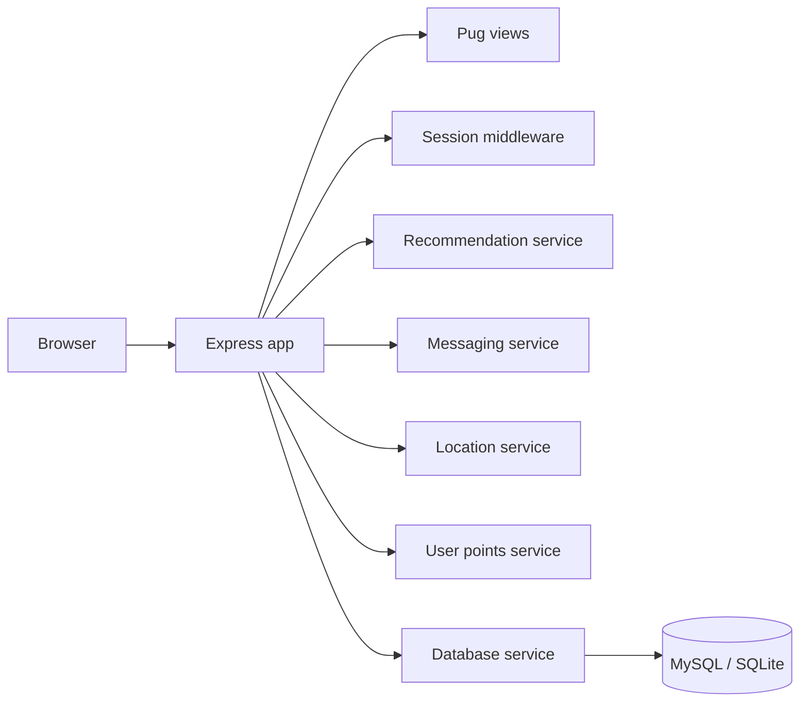

# Minimise Food Waste


A full-stack **Node.js / Express** food-sharing platform designed to help communities reduce food waste by sharing surplus food, discovering nearby listings, receiving personalised recommendations and communicating with other users.

**Tech:** JavaScript · Node.js · Express.js · Pug · Bootstrap · MySQL / SQLite · Docker · GitHub Actions

---

## Final application preview

The screenshots below come from the project's **Sprint 4 final documentation** and show the user-facing application produced by the team.

### Home


The landing page introduces the platform and gives users direct routes to **share food** and view **recommendations**. It also presents the project's advanced feature areas, including smart matching, rewards, messaging and location services.

### Browse available food


Users can explore available food listings in a card-based interface. Listings expose useful information such as category, quantity and dietary suitability so users can quickly judge whether an item is relevant to them.

### Personalised recommendations


The recommendations interface presents suggested food matches and filters. The Sprint 4 design describes the recommendation concept using preference analysis and collaborative filtering to surface more relevant listings.

### Login and account access


The account flow provides email and password entry together with a **remember me** option for returning users.

The wider final application also includes **smart matchmaking, food tagging/listing creation, user profiles, points/rewards and messaging**.

---

## What the application does

- **Share surplus food** by creating structured food listings.
- **Browse available items** with category, quantity, expiry, location and dietary information.
- **Receive recommendations** through dedicated recommendation-oriented application logic.
- **Message other users** to support food collection and community interaction.
- **Track user activity** through profile and points/reward features.
- **Use location-aware behaviour** as part of the food-sharing workflow.

## Engineering highlights

| Area | Implementation |
| --- | --- |
| Backend | Node.js, Express.js, routing, sessions and service-layer organisation |
| Frontend | Pug templates, Bootstrap/CSS and server-rendered views |
| Recommendations | Dedicated `recommendationService.js` |
| Messaging | Dedicated `messagingService.js` |
| Location logic | Dedicated `locationService.js` |
| User rewards | Dedicated `userPointsService.js` |
| Data | MySQL / SQLite dependencies and database service layer |
| DevOps | Docker, Docker Compose and environment configuration |
| Testing | Nightwatch configuration and GitHub Actions checks |
| Collaboration | Multi-contributor Git/GitHub development workflow |

## Architecture



The main Express application is located in `app/app.js`, while feature-specific behaviour is separated into service modules under `app/services/`.

See [`docs/ARCHITECTURE.md`](docs/ARCHITECTURE.md) for a concise repository map.

## Main user journeys

The application contains views for:

- home / landing experience
- login and sign-up
- browsing food listings
- viewing listing details
- personalised recommendations
- smart matchmaking
- creating/tagging food listings
- messaging and conversations
- user profiles
- about / information pages

## Project structure

```text
.
├── app/
│   ├── app.js
│   ├── public/
│   ├── services/
│   │   ├── db.js
│   │   ├── locationService.js
│   │   ├── messagingService.js
│   │   ├── recommendationService.js
│   │   └── userPointsService.js
│   └── views/
├── custom-tests/
├── database-file/
├── docs/
│   ├── ARCHITECTURE.md
│   └── screenshots/
│       └── final-app/
│           ├── home.jpg
│           ├── browse-food.jpg
│           ├── recommendations.jpg
│           └── login.jpg
├── Dockerfile
├── docker-compose.yml
├── docker-compose-deploy.yml
├── env-sample
├── package.json
├── package-lock.json
├── README.md
└── .github/workflows/node-ci.yml
```

## Run locally

### With Docker

Requirements:

- Docker Desktop
- Docker Compose

Create the environment file:

```bash
cp env-sample .env
```

On Windows Command Prompt:

```cmd
copy env-sample .env
```

Start the stack:

```bash
docker compose up --build
```

### With Node.js

```bash
npm ci
npm start
```

The development start script uses `supervisor` so relevant source changes can restart the application automatically.

## Testing and CI

The repository includes Nightwatch browser-test configuration and custom test files. The portfolio GitHub Actions workflow provides a reliable baseline by:

1. installing dependencies with `npm ci`;
2. validating the main Express application for JavaScript syntax errors;
3. validating the service modules for JavaScript syntax errors.

This keeps the public repository continuously verifiable without requiring an interactive browser or external database for the baseline CI job.

## Security and deployment scope

> [!IMPORTANT]
> This is an academic/demo application, not a production food-sharing service.

The repository contains development-oriented session/data behaviour and sample application flows. A production version would require additional security work such as secure credential storage, password hashing, CSRF protection, hardened sessions, production database migrations and wider validation/security testing.

## Academic context

This repository is based on a University of Roehampton software-engineering team project. The portfolio version keeps the implemented application and engineering work while presenting it in a cleaner format for technical and recruiter review.

The final UI screenshots above were taken from the project's Sprint 4 documentation.

## Author / repository owner

**Mohamed Ibrahim**  
BEng Software Engineering, University of Roehampton
