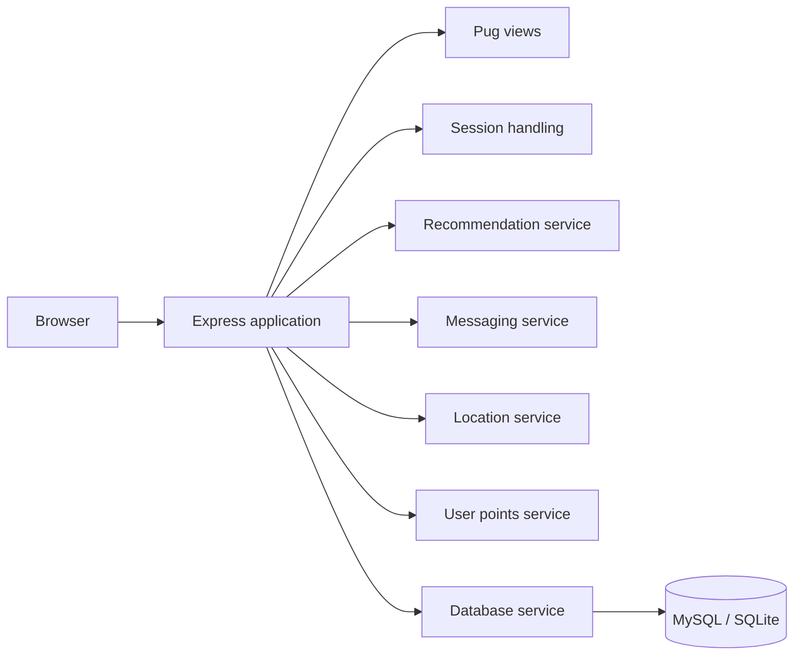
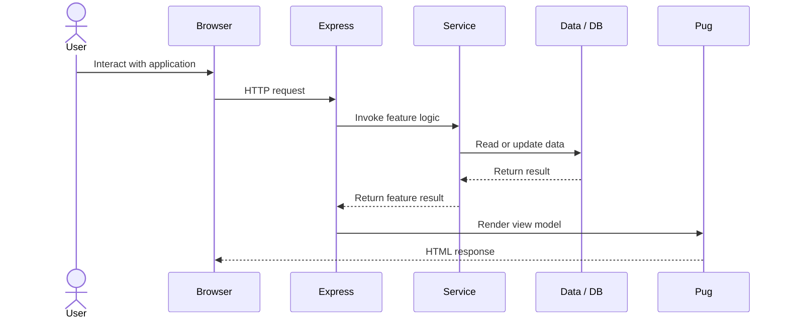

# Architecture Overview

[← Back to the main README](../README.md)

This document gives a concise engineering view of the **Minimise Food Waste** application and shows how the main Express app, service modules, views and data layer fit together.

## High-level structure

## Application entry point

`app/app.js` is the main Express application. It configures rendering, sessions, request handling, static assets and the core user-facing routes.

## Service layer

Feature-oriented behaviour is separated into modules under `app/services/`:

| Module | Responsibility |
| --- | --- |
| `db.js` | Database connection and query support |
| `recommendationService.js` | Recommendation-oriented logic |
| `messagingService.js` | Messaging and conversation behaviour |
| `locationService.js` | Location-aware application behaviour |
| `userPointsService.js` | Points and reward-related behaviour |

This separation keeps feature logic easier to find than placing everything directly inside route handlers.

## Presentation layer

Pug templates under `app/views/` render the server-side user interface, including flows for:

- login and account access,
- browsing and viewing food listings,
- recommendations and smart matchmaking,
- messaging and conversations,
- user profiles,
- informational pages.

## Data and infrastructure

The repository includes MySQL/SQLite dependencies alongside Docker and Docker Compose configuration for repeatable local development. Environment-variable scaffolding is supplied through `env-sample`.

## Typical request flow

## Portfolio scope

The codebase demonstrates a multi-feature Express application with a separate service layer, server-rendered views, database integration and development tooling. Some authentication and data flows remain coursework/demo oriented, so the repository should be treated as an academic full-stack project rather than a production deployment.

For the user-facing product, see the **[Final Application Walkthrough](FINAL_APP.md)**.
