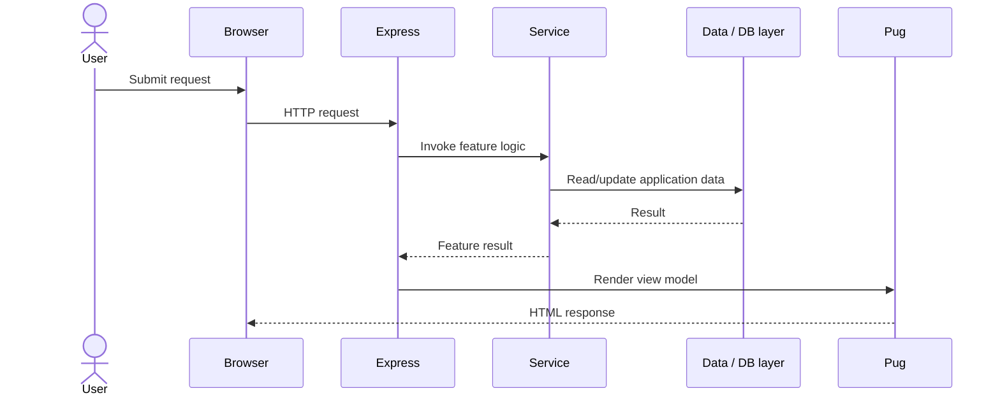

# Architecture Overview

## Application entry point

`app/app.js` configures the Express application, Pug rendering, sessions, request-body parsing, static assets and the main user-facing routes.

## Service layer

Business-oriented behaviour is separated into modules under `app/services/`:

- `db.js` — database connection/query support.
- `recommendationService.js` — recommendation-oriented logic.
- `messagingService.js` — messaging/conversation behaviour.
- `locationService.js` — location-related application logic.
- `userPointsService.js` — points/reward behaviour.

## Presentation layer

Pug templates under `app/views/` render the server-side UI for login, sign-up, listings, recommendations, messages, conversations and other application pages.

## Data and infrastructure

The repository includes MySQL/SQLite dependencies plus Docker and Docker Compose configuration for repeatable local development. Environment-variable scaffolding is supplied through `env-sample`.

## Request flow

## Portfolio interpretation

The codebase demonstrates a service-oriented Express structure rather than a single-file demo. Some data and authentication flows remain development/coursework-oriented, so the repository should be treated as an academic full-stack project rather than a production deployment.
